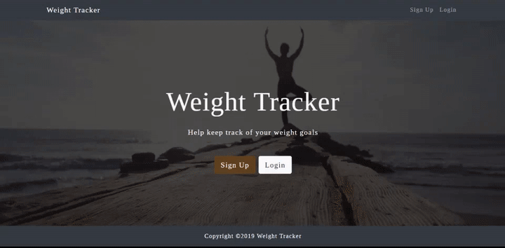
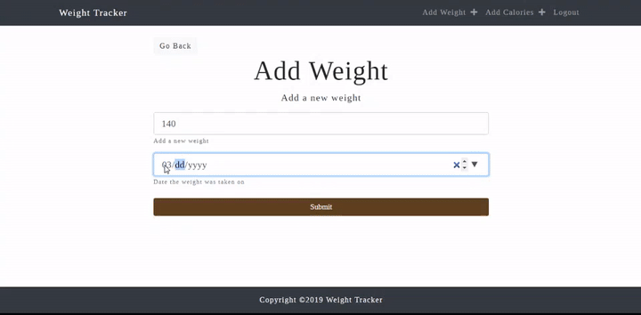
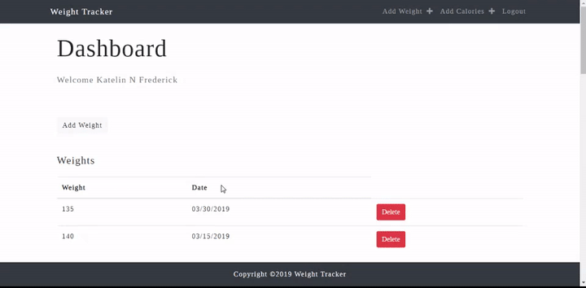

# Weight Tracker

## Author

Katelin Frederick 2019

##Table of Contents
* [About this Project](#about-this-project)
* [Goal of this Project](#goal-of-this-project)
* [Installation](#installation)
* [Technologies](#technologies)
* [What I learned](#what-i-learned)
* [Demos](#demos)

## About this Project
Web application that allows the user to track certain aspects of the users fitness.  Charts users weight on a given date using Chart.js as well as the amount of calories the user consumed on a given date.  Calculates the users BMI and caloric needs.

## Goal for this Project
The goal of this project was to learn about the MERN stack and the Chart.js library.

## Installation
```
# Install dependencies for the server
$ npm install

# Install dependencies for the client
$ npm run client-install

# Run the client & server with concurrently
npm run dev

# Run the Express server only
npm run server

# Run the React client only
npm run client

# Server runs on http://localhost:5000 and client on http://localhost:3000
```

## Technologies
* React
* Express
* Node.js
* MongoDB
* CSS
* javaScript
* Chart.js

## What I learned
I learned how to use the Chart.js library in a React Application.  I also became more comfortable setting up a database with MongoDB and creating routes.

## Demos




